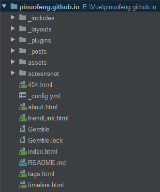
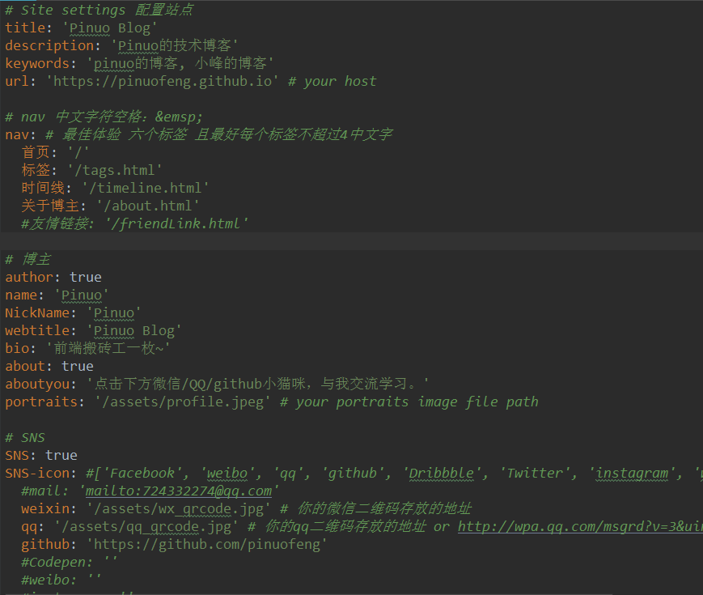

### 一、创建一个新仓库 
进入Repositories点击<New>按钮创建一个新仓库：    
    
图中红线部分为仓库名，“username”必须和你的Github登录名一样，并且后面必须是以“.github.io”结尾。如：我的
登录名是 pinuofeng，所以我的仓库名应为：pinuofeng.github.io；点击下方Create repository按钮完成创建。    
完成创建后下载一个 [GitHub Desktop](https://desktop.github.com/)，这是一个Github
桌面端项目管理工具，下载后使用你的Github账号登录，将刚刚创建的项目clone到本地。    

### 二、下载一个Jekyll模板
去[Jekyll主题官网](http://jekyllthemes.org/)选择一款自己喜欢的模板，下载后将文件夹里所有的文件copy到
刚刚创建好的新仓库里，然后用GitHub Desktop提交到Github。完成这一步之后，再打开https://你的github登录名.github.io
就可以看到自己的新网站了。

### 三、修改Jekyll模板，发布一篇博客
此时你的项目结构应该类似于这个样子：     
      
你下载的项目模板可能和我的有所差异，不过这并不影响什么。因为我们需要关注的只有其中几个文件：       
1、_config.yml: 这是项目的配置文件，可以配置页面标题、nav导航、分页等等。如下图：      
        

2、_posts文件夹：这里是存放你所有文章的地方，这个文件夹里面的每一个文件都应该是一个markdown文件，而每一个文件
就是你的一篇博文。    

Markdown是一种可以使用普通文本编辑器编写的标记语言，通过简单的标记语法，可以生成静态html页面或pdf文件。
我们之后写博文就需要用到这个语言，不了解的童鞋可以戳这里了解一下[markdown语法](https://www.jianshu.com/p/f3147a804368)    

